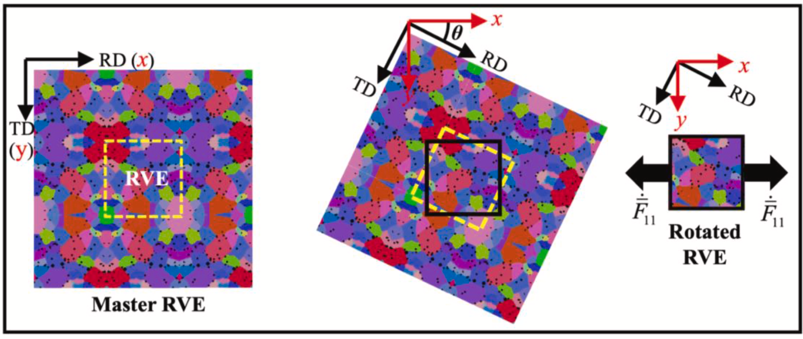

# Readme

## Overview

This repository provides a Python workflow for performing crystal plasticity (CP) simulations in **DAMASK 3.0.0** to obtain **direction-dependent stress–strain curves** and **Lankford coefficients (*r*-values)** from a **Dream3D-generated representative volume element (RVE)**. The loading directions are defined with respect to the **rolling direction (RD)**.

The script rotates the RVE and the corresponding grain orientations, runs uniaxial tensile simulations for a series of in-plane angles, and writes the simulated results for all tested directions into a CSV table.

## What the code does

For each loading angle relative to the rolling direction, the script:

1. loads the RVE geometry from a Dream3D file (The "RealRVE_1_1.dream3d.zip" needs to be unzipped in this repository),
2. mirrors and crops the geometry to construct a larger master domain,
3. rotates the geometry to the target angle,
4. rotates the crystallographic orientations consistently,
5. runs a DAMASK tensile simulation,
6. extracts the macroscopic stress–strain response, and
7. computes the *r*-value from the simulated strain tensor.

The final output is a CSV file containing, for each angle, the following columns:

- `PlasticStrain_<angle>`
- `r_<angle>`
- `epsilon_<angle>`
- `sigma_<angle>`

## Workflow illustration

The rotation-and-cropping strategy used by the script is illustrated in **Section 3.2** of the following paper:

Lu, K., Zhou, Y., Solhjoo, S., Naghinejad, M., van Tijum, R., Pei, Y. T., & Post, J. (2025). *Investigating carbide characteristics effect on multiscale mechanical behavior of AISI 420 steel using crystal plasticity simulation*. *Journal of Materials Research and Technology, 36*, 10487–10506. https://doi.org/10.1016/j.jmrt.2025.05.235

## Essential inputs

To run the workflow, you need the following inputs:

### 1. Dream3D RVE file
A Dream3D file containing the RVE geometry.

### 2. Grid size of the RVE
The number of grid cells in the three spatial directions:

- `cell_num_1`: number of cells in x
- `cell_num_2`: number of cells in y
- `cell_num_3`: number of cells in z

### 3. Constitutive parameter files for each phase
YAML material-property files for all phases used in the simulation.

In the current workflow, the following phases are assigned:

- **Ferrite**
- **Carbide**

The constitutive parameters attached to this workflow were calibrated using **particle swarm optimization (PSO)** so that the simulated flow curves match the experimental flow curves as closely as possible. The detailed procedures are described in the above mentioned paper:

- a **ferrite** phase calibrated against experiments, and
- a **carbide** phase treated as a **hard particle**.

## Version note

The code below is based on **DAMASK 3.0.0**.

If you use a newer DAMASK version, the parts related to:

- loading the Dream3D file, and
- defining material properties

may have changed and may require adaptation.

## Main outputs

The main output is a CSV file, named `r.csv`, that stores the mechanical response for all simulated directions. Of course, you can also export the vti files and displaied them in **Paraview**.

Each tested angle contributes four columns to the table:

- plastic strain,
- *r*-value,
- equivalent strain, and
- equivalent stress.

The script also generates intermediate DAMASK geometry during rotation and result files during execution.

## Notes

- The code is intended for in-plane tensile tests from **0° to 90°** relative to the rolling direction.
- In the provided example, the angular increment is **15°**.
- The carbide phase is modeled as a hard constituent in the supplied parameterization.
